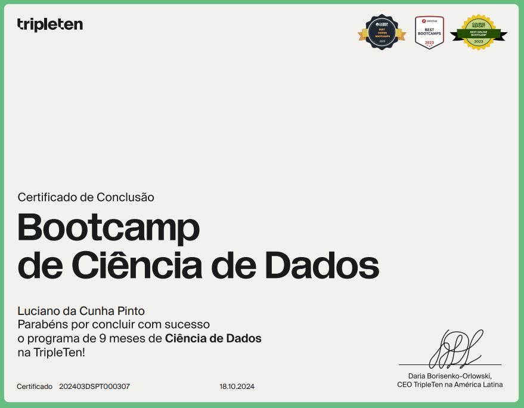

## Boas-vindas!!

👋 Olá! Eu sou o Luciano da Cunha Pinto, graduado em Administração e Engenharia Civil, com ampla experiência em **Quality Assurance (QA)** e projetos de engenharia. Atuo há mais de 10 anos na área de **QA**, onde desenvolvi um olhar analítico e foco em automação de testes, auditoria de dados e otimização de processos.  

💡 Durante minha trajetória, aprofundei meus conhecimentos em **Ciência de Dados e Inteligência Artificial**, aplicando técnicas de **modelagem preditiva, aprendizado de máquina e estatística** para aprimorar processos de qualidade e tomada de decisão. Tenho experiência prática com **Python** (Pandas, NumPy, Scikit-learn, LightGBM, Statsmodels...), **SQL**, **Cypress, Selenium e PyTest**, além de ferramentas de visualização como **Tableau e Power BI**.  

📊 Gosto de explorar soluções inovadoras para garantir a qualidade de produtos e processos, utilizando tecnologia e automação como aliadas. Meu inglês avançado me permite atuar em ambientes internacionais e acessar conteúdos técnicos de ponta.  

🚀 Vamos trocar ideias e crescer juntos nessa jornada de tecnologia e dados! Se precisar de ajuda ou quiser compartilhar experiências, fique à vontade para me chamar.  

📫 **Vou adorar receber seu contato:**

## Certificados:

    
    

    
    

## Confira alguns dos meus projetos:

| **Projeto**            | **Link**                          | **Linguagem** | **Observação**           |
|------------------------|-----------------------------------|---------------|--------------------------|
| *Interconnect* | [Previsão de Churn usando Machine Learning](https://github.com/lucianolcp/Projeto_Ciencia_de_Dados_Interconnect) | Python (Pandas, Scikit-learn, Optuna, SHAP, XGBoost) | Desenvolvimento de um modelo para prever a rotatividade de clientes de uma operadora de telecomunicações. O projeto utiliza dados contratuais, pessoais e de serviços para treinar modelos de classificação e otimizar hiperparâmetros, visando identificar clientes propensos a cancelar os serviços. | 
| *Projeto OilyGiant*    | [Aprendizado Automático para os Negócios](https://github.com/lucianolcp/Projeto_Ciencia_de_Dados_OilyGiant)  | Python (Pandas, Numpy, Scikit-Lear)        |  Aplicação de aprendizado automático para prever reservas de petróleo e selecionar a região mais lucrativa. Utilização de Bootstrapping para análise de risco e estimação de lucro potencial.  |
| *Proteja Seu Amanhã*     | [Álgebra Linear](https://github.com/lucianolcp/Projeto_Ciencia_de_Dados_Proteja_Seu_Amanha)  | Python (Pandas, Numpy, Scikit-Lear, Seaborn)            | Implementação de métodos de aprendizado de máquina com álgebra linear para a companhia de seguros Proteja Seu Amanhã, com foco em: encontrar clientes semelhantes, prever pagamentos de seguro e quantidade de pagamentos com modelos de regressão, e aplicar técnicas de ofuscação de dados para proteger a privacidade sem afetar a eficácia dos modelos        |
| *Rusty Bargain*     | [Métodos Numéricos](https://github.com/lucianolcp/Projeto_Ciencia_de_Dados_Rusty_Bargain )  | Python (Pandas, Numpy, Scikit-Lear, LightGBM, Matplotlib e Seaborn)           | Aplicação de métodos numéricos e algoritmos de Machine Learning, como LightGBM, Floresta Aleatória e Gradient Boosting, para a previsão eficiente do valor de mercado de veículos, utilizando a métrica REQM para medir a acurácia do modelo.      |
| *Sweet Lift Taxi*     | [Séries Temporais](https://github.com/lucianolcp/Projeto_Ciencia_de_Dados_Sweet_Lift_Taxi)  | Python (Statsmodels, Facebook Prophet, TensorFlow/Keras)           | Modelagem de séries temporais com Machine Learning para previsão de demanda de táxi.      |  
| *Film Junky Union*     | [Aprendizado Automático para Textos](https://github.com/lucianolcp/Projeto_Ciencia_de_Dados_Film_Junky_Union)  | Python (NLTK, spaCy, Scikit-learn, LightGBM)           | Criação de um modelo de aprendizado automático para textos que classifica resenhas de filmes como positivas ou negativas. Utilizando um conjunto de dados do IMDB, o projeto visa alcançar uma métrica F1 mínima de 0,85 para a detecção de resenhas negativas.      |  
